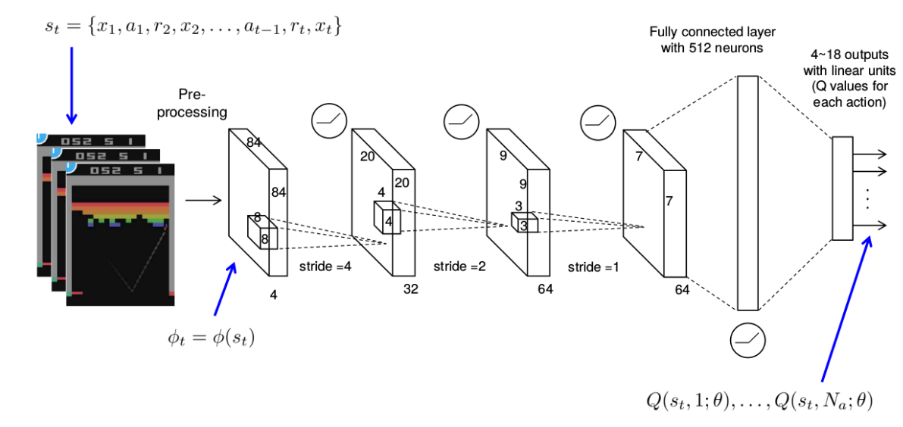
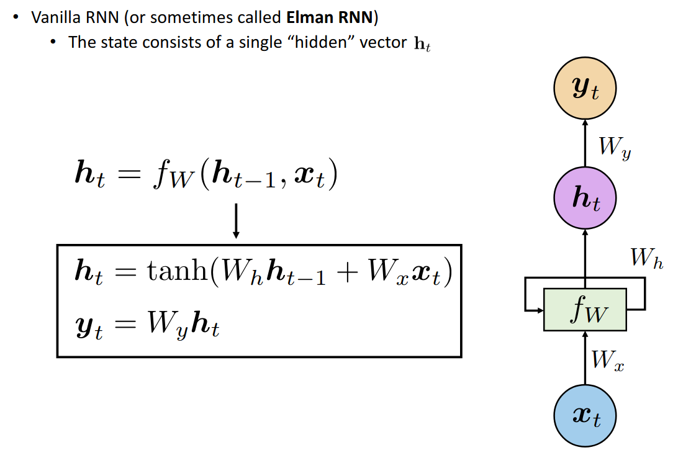
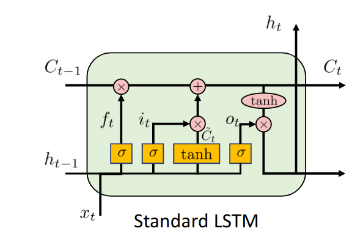
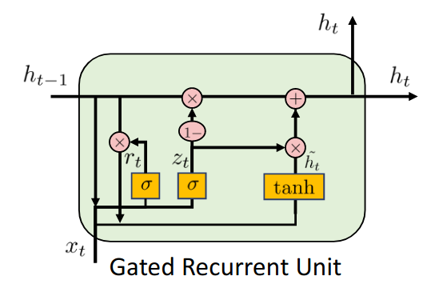

# DQN et DRQN

<link rel="stylesheet" href="https://cdnjs.cloudflare.com/ajax/libs/KaTeX/0.5.1/katex.min.css">
<link rel="stylesheet" href="https://cdn.jsdelivr.net/github-markdown-css/2.2.1/github-markdown.css"/>

## Planification vs Apprentissage par renforcement

+ **Planification** : on a accès à la dynamique de l'environnment $p(s' | s, a)$ et $p(o | s, a)$ 
  +  Calcul explicite de la statistique $b_t = p(s | h_t)$
  +  Calcul de la valeur exacte des équations de Bellman
+ **Apprentissage par renforcement** : pas d'accès à la dynamique, juste les échantillons générés ($o_0, a_0, r_1, o_1, a_1, r_2, .., etc$)
  + Comment construire une croyance $b_t$ ?
  + Comment estimer $V^{\pi}$ (ou $Q^{\pi}$) ?
  + Comment estimer $V^{*}$ (ou $Q^{*}$) ?

**Solution** : $\rightarrow$ on les estime

## Estimation de la fonction de valeur d'action $Q^{\pi}$

Définition de la Q-valeur:
$$q^{\pi}_{t}(s, a) = \mathbb{E}_{\pi}\left[ \sum_{i=t+1}^{T} \gamma^{t-i+1} R_{i} \mid S_t = s, A_t = a\right]$$

Equation de Bellman :
$$q^{\pi}_{t}(s, a) = \mathbb{E}_{\pi}\left[ R_{t+1} + \gamma q^{\pi}_{t+1}(S_{t+1}, A_{t+1}) \mid S_t = s, A_t = a\right]$$

**Note** : l'espérance est une moyenne probabiliste

$$q^{\pi}_{t}(s_t, a_t) \approx \frac{1}{n} \sum_{i=1}^n \left[ r_{t+1}^{(i)} + \gamma q^{\pi}_{t+1}(s_{t+1}^{(i)}, a_{t+1}^{(i)}) \right]$$

### Algo SARSA 

**Mise à jour par moyenne mobile** : A chaque pas de temps et chaque (s, a, r, s', a') généré, on applique :

$q^{\pi}_{t}(s_t, a_t) \leftarrow (1-\alpha_t) q^{\pi}_{t}(s_t, a_t) + \alpha_t \left[ r_{t+1} + \gamma q^{\pi}_{t+1}(s_{t+1}, a_{t+1}) \right]$

$q^{\pi}_{t}(s_t, a_t) \leftarrow q^{\pi}_{t}(s_t, a_t) + \alpha_t \left( \left[ r_{t+1} + \gamma q^{\pi}_{t+1}(s_{t+1}, a_{t+1}) \right] - q^{\pi}_{t}(s_t, a_t)\right)$

On peut prouver que sous certaines conditions (notamment sur $\alpha_t$), l'algo converge vers la **VRAI** valeur $q^{\pi}$.

## Estimation de la fonction de valeur d'action optimale $Q^{*}$

Définition de la Q-valeur:
$$q^{*}_{t}(s, a) = max_{\pi} \left[ \mathbb{E}_{\pi}\left[ \sum_{i=t+1}^{T} \gamma^{t-i+1} R_{i} \mid S_t = s, A_t = a\right] \right]$$

Equation d'optimalité de Bellman :
$$q^{*}_{t}(s, a) = \mathbb{E}\left[ R_{t+1} + \gamma \max_{a'}  q^{*}_{t+1}(S_{t+1}, a') \mid S_t = s, A_t = a\right]$$

**Note** : l'espérance est une moyenne probabiliste

$$q^{*}_{t}(s_t, a_t) \approx \frac{1}{n} \sum_{i=1}^n \left[ r_{t+1}^{(i)} + \gamma \max_{a'}  q^{*}_{t+1}(s_{t+1}^{(i)}, a') \right]$$

### Algo Q-learning 

**Mise à jour par moyenne mobile** : A chaque pas de temps et chaque (s, a, r, s', a') généré, on applique :

$q^{*}_{t}(s_t, a_t) \leftarrow (1-\alpha_t) q^{*}_{t}(s_t, a_t) + \alpha_t \left[ r_{t+1} + \gamma \max_{a'}  q^{*}_{t+1}(s_{t+1}, a') \right]$

$q^{*}_{t}(s_t, a_t) \leftarrow q^{*}_{t}(s_t, a_t) + \alpha_t \left( \left[ r_{t+1} + \gamma \max_{a'} q^{*}_{t+1}(s_{t+1}, a') \right] - q^{*}_{t}(s_t, a_t)\right)$

On peut prouver que sous certaines conditions (notamment sur $\alpha_t$), l'algo converge vers la **VRAI** valeur $q^{*}$.

## L'algorithme DQN 

Algorithme du Q-learning dans lequel on représente la Q-valeur par un réseau de neurones (NN). 

On assume que l'horizon est infini et on nomme les paramètres du réseau de neurones sont $\theta$. Notre but est d'ajuster les paramètres $\theta$ pour que $q^{\theta^*} \approx q^*$.

La règle de mise à jour peut se réécrire sous la forme d'un problème de minimisation. A chaque pas de temps, on exécute une descente de gradient dans le but de minimiser:

$$\mathbf{L}(\theta) = \frac{1}{2} \left[ r_{t+1} + \gamma \max_{a'} q^{\theta}_{t+1}(s_{t+1}, a') - q^{\theta}_{t}(s_t, a_t) \right]^2$$

Mise à jour des $\theta$ : 
$$\theta_{t+1} = \theta_t + \alpha_t \nabla_{\theta}\mathbf{L}(\theta_t)$$

**DQN pour Atari Games:**

### Quelques astuces pour booster les résultats
- Mieux utiliser l'expérience (*Experience Replay*)
  - Garde en mémoire l'expérience passée
  - Chaque update utilise un **batch** d'expériences passées pour mettre à jour le modèle
  - **Proritized** Experience Replay $\rightarrow$ fait revenir plus souvent les échatillons rare / mauvais
- Utiliser un modèle cible
  - Eviter de changer trop souvent la cible

**Problème** : Q-learning converge vers la solution optimale seulement pour MDP !!!!

## L'agorithme DRQN = DQN + Maintient d'une croyance $b_t$

**Objectif** : Pour résoudre POMDP, on a besoin de travailler sur des historiques $h_t$ ou sur des croyances $b_t$.

**Idée** : Utiliser un réseau de neurones récurrent (**RNN**) pour représenter $q$. Ainsi, on ne représente plus $q^{\theta}_t(s_t, a_t)$ mais $q^{\theta}_t(h_t, a_t)$.

### Différents types de RNN

**La version simple:**

**La version plus complexe**

**La version complexe mais pas trop**

